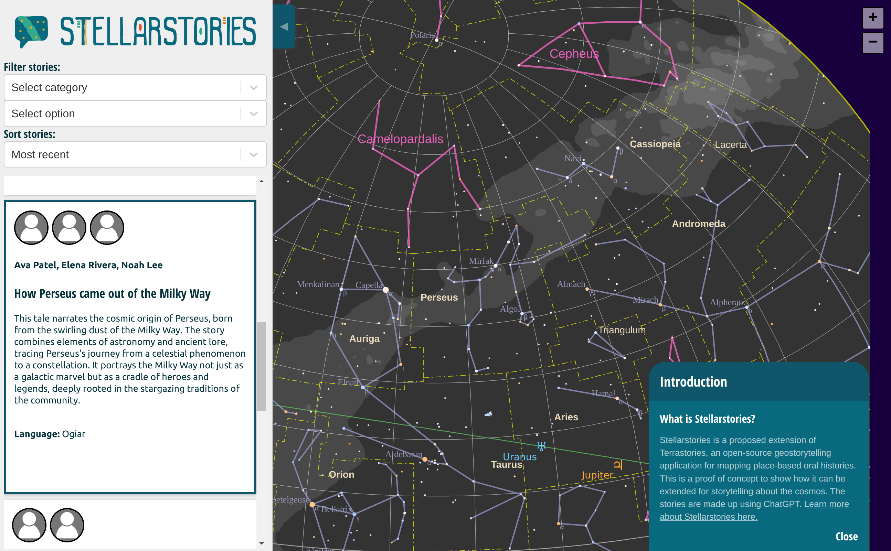
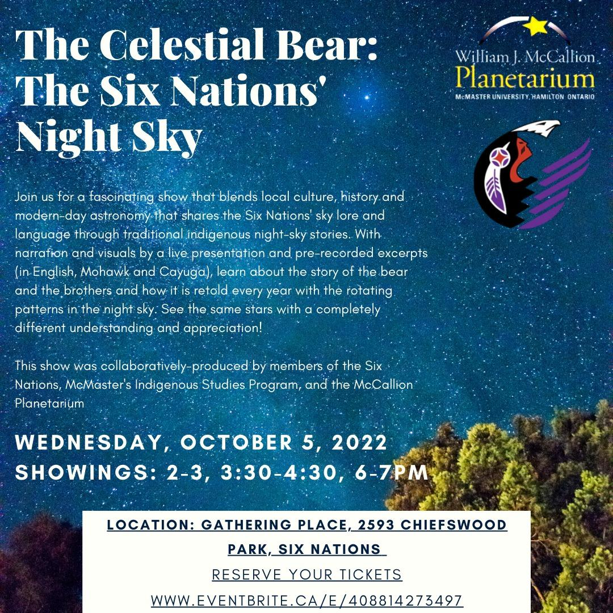

# Stellarstories: community storytelling about the cosmos

This repo provides a proof of concept for Stellarstories, a sister project to [Terrastories](https://github.com/terrastories/terrastories). Currently, it is a lightweight Create React App that serves only a version of the React front-end of Terrastories that has been modified to use [d3-celestial](https://github.com/) instead of Maplibre GL, and utilize hard-coded sample data instead of real data from the Terrastories Rails API. However, there is also [a branch on the main Terrastories repo](https://github.com/Terrastories/terrastories/tree/stellarstories). (This minimal proof of concept was developed entirely offline while on a series of planes from one side of the planet to the other.)

If we decide to build Stellarstories as an extension of Terrastories instead of a unique application, the plan would be to build out a shared core architecture for both Terrastories and Stellarstories (and any future extensions). This will help us guarantee and further develop platform stability for both apps, if one is being worked on. We still have to scope out the best way to do this in terms of repo management.

## How to contribute

We would love your ideas and links for possible inspiration for this project! Please feel free to share by adding to the [Inspirations directory](./inspirations/). Please contribute a markdown file with a title, contributor source, and any descriptive content.

If you are interested in helping build Stellarstories in some way, please join the [#terrastories channel on Slack](https://rubyforgood.herokuapp.com/).

## Concept note

We humans have always been fascinated by, and in awe of the sublime celestial bodies that surface above our heads every day when the skies turn dark. Since time immemorial, our ancestors have tried to make sense of the mysteries of the vast galaxy, and our position within it. Numerous cultures across the world have their own cosmologies about the stars, planets, constellations, galaxies, and other stellar apparitions. In contemporary times, although the scientific field of astronomy has enabled us to obtain a deep understanding of the origins and physical properties of the universe, the rich mythologies of the stars as gifted to us by the ancient Greeks continues to enthrall us as we gaze upwards to the night sky. However, the Greeks were hardly the only culture to articulate a rich tapestry of stories about the stars; Indigenous communities the world over have their own storytelling traditions about the cosmos and constellations[^1][^2], which may well be some of the most ancient oral histories that our species continues to pass along to younger generations, and therefore comprise an invaluable source of our shared intangible cultural heritage. Yet, these stories are hardly known or documented, and are at high risk of being lost as oral history storytelling traditions are at risk of disappearing due to acculturation and other pressures, along with increased light pollution[^3].

To prevent this from happening, the Terrastories stewards team are proposing _Stellarstories_, which represents both a technological intervention and a call to action.

For the past four years, we have been building an open-source geostorytelling application called Terrastories, used by Indigenous and other communities to map and locate their place-based stories. Terrastories is being used by communities in South America, Africa, and Turtle Island, and is a proven resource for mapping, documenting and sharing oral histories about storied places on the earth. Now, we propose to leverage the Terrastories codebase to create a sister application of Terrastories for mapping oral histories about the cosmos, called _Stellarstories_. We will adapt the Terrastories API, CMS, and front-end to work with an interactive canvas of the cosmos. Communities will be able to use the same features in Terrastories to control who has access to the content, decide on whether to host their stories online or offline, create curricula of stories for educational purposes, and design a public view of their _Stellarstories_ for a global audience to explore.

However, _Stellarstories_ is more than just a vision and a technical roadmap for the creation of a digital application: it won't succeed without our involvement, and therefore it is also a call to action to get involved in documenting the stellar stories from our own cultures. As part of the _Stellarstories_ inception project, we propose to host a fellowship for an Indigenous community member to serve as an ambassador for the tool, and to create the first pilot _Stellarstories_ instance for their community. This will serve as a model for other communities as they start to consider how to map their own knowledge of the night skies, and what they want to share with the rest of humanity.

_With deep gratitude to the Internet Archive and the DWeb Camp 2022 team for creating the space that enabled this idea to spontaneously emerge from the minds of technologists, designers, Indigenous community members, and others seeking to co-imagine resources for responsibly managing a digital commons._

_Astronomy planetarium show focused on Indigenous knowledge of the night sky organized on Six Nations Reserve, where Terrastories is actively being used by community members who also participated in DWeb Camp 2022 as part of the Ohneganos project, funded by an Unfinished grant._

[^1]: [https://www.zmescience.com/science/ethnoastronomy-brazilian-american-28102021/](https://www.zmescience.com/science/ethnoastronomy-brazilian-american-28102021/)

[^2]: [https://theconversation.com/supernovas-auroral-sounds-and-hungry-tides-unpacking-first-nations-knowledge-of-the-skies-178875](https://theconversation.com/supernovas-auroral-sounds-and-hungry-tides-unpacking-first-nations-knowledge-of-the-skies-178875)

[^3]: [https://www.discovermagazine.com/environment/light-pollution-threatens-millennia-old-indigenous-navigation-methods](https://www.discovermagazine.com/environment/light-pollution-threatens-millennia-old-indigenous-navigation-methods)